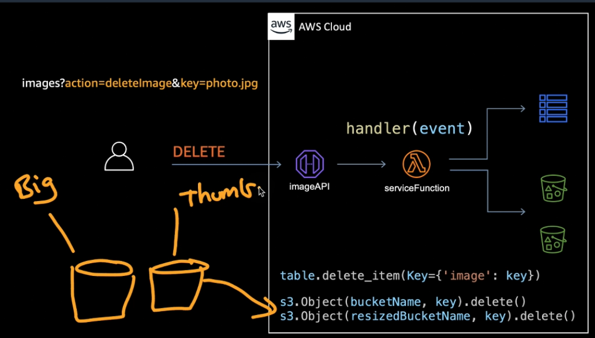

Serverless image recognition app built using core AWS services

1. Cognito
2. API Gateway
3. S3
4. SQS
5. Lambda
6. DynamoDB
7. Rekognition

### Ep. 1

- setup cdk
- setup S3 image bucket
  - used for storing the imgs for our app
  - output to cfn
- setup DynamoDB
  - table 'Image'
  - output to cfn
- built Lambda function
  - python runtime
  - envs: table and imagebucket
  - add event source
  - grant permissions to imagebucket and tble
  - add IAM policy
- end of episode - cdk destroy to cleanup

### Ep. 2

- [explanation of sync vs async Lambda functions](https://www.stackery.io/blog/aws-lambda-sync-or-async/)
- creating lambda fun to interact with the api gateway
  - using Pillow library for creating thumbnail imgs
- setting up dynamodb table to interact with the Lambda api Fn
- creating s3 bucket for thumbnails to be stored after being sent to rekognition

### Ep. 3

- API Gateway: REST API
- /images
- DELETE
- GET
  
  
